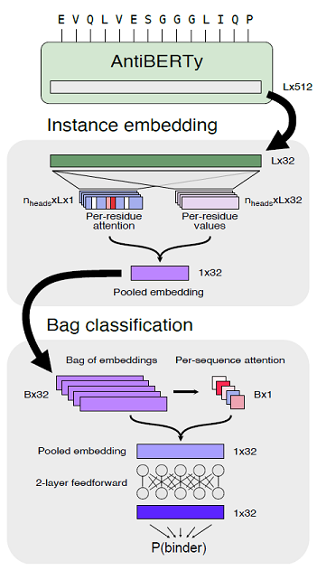

# antiberty-pytorch



## installation
```bash
$ pip install antiberty-pytorch
```

## Reproduction status

Reproduction with about tiny ~1% of the entire OAS data is currently on running. The live training log can be found [here](https://api.wandb.ai/links/dohlee/qqzxgo1v).

## Observed Antibody Sequences (OAS) dataset preparation pipeline

I wrote a `snakemake` pipeline in the directory `data` to automate the dataset prep process. It will download metadata from [OAS](https://opig.stats.ox.ac.uk/webapps/oas/oas) and extract lists of sequences. The pipeline can be run as follows:

```bash
$ cd data
$ snakemake -s download.smk -j1
```

*NOTE: Only 3% of the entire OAS sequences were downloaded for now due to space and computational cost.*

*TODO: Hint for total # of sequences, total size*