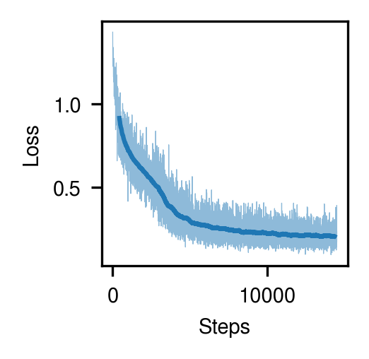

# antiberty-pytorch
[](https://github.com/Lightning-AI/lightning)


## installation
```bash
$ pip install antiberty-pytorch
```

## Reproduction status

### Number of parameters


This version of AntiBERTy implementation has 25,759,769 parameters in total, and it matches well with the approx. 26M parameters specified in the paper (See above).

### Training with 1% of the entire OAS data

I've reproduced AntiBERTy training with about tiny ~1% of the entire OAS data (`batch_size=16`, `mask_prob=0.15`) and observed pretty reasonable loss decrease, though it's not for validation set.
The training log can be found [here](https://api.wandb.ai/links/dohlee/qqzxgo1v).



## Observed Antibody Sequences (OAS) dataset preparation pipeline

I wrote a `snakemake` pipeline in the directory `data` to automate the dataset prep process. It will download metadata from [OAS](https://opig.stats.ox.ac.uk/webapps/oas/oas) and extract lists of sequences. The pipeline can be run as follows:

```bash
$ cd data
$ snakemake -s download.smk -j1
```

*NOTE: Only 3% of the entire OAS sequences were downloaded for now due to space and computational cost. (83M sequences, 31GB)*

## Citation
```bibtex
@article{ruffolo2021deciphering,
    title = {Deciphering antibody affinity maturation with language models and weakly supervised learning},
    author = {Ruffolo, Jeffrey A and Gray, Jeffrey J and Sulam, Jeremias},
    journal = {arXiv},
    year= {2021}
}
```
